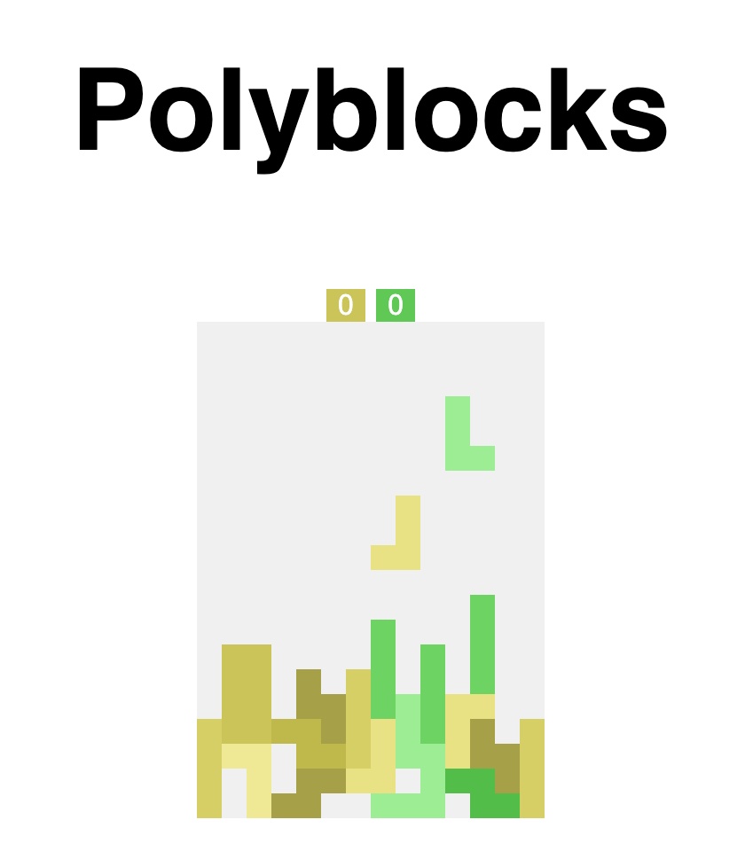

# Polyblocks

Multiplayer Tetris game where every connected player shares the same playfield.
The board widens as players join and shrinks again when they leave,
so the game scales seamlessly from a single-player session to a crowded match.



Built with [Bun], [Express], [Socket.IO], [TypeScript], and [Stylus].

[Bun]: https://bun.sh/
[Express]: https://expressjs.com/
[Socket.IO]: https://socket.io/
[TypeScript]: https://www.typescriptlang.org/
[Stylus]: https://stylus-lang.com/


## How It Works

- The server holds the authoritative game state
  (field, pieces, scores) in `routes/polyblocks.ts`.
- Each client opens a Socket.IO connection and receives `base` events
  containing the current players, field, and score on every tick.
- Player input is sent back as `update` events with the pressed key name
  (`up`, `down`, `left`, `right`, `space`).
- When a player joins, the field is extended by 4 columns;
  when one leaves, it is reduced again.
- Drop speed accelerates as cleared lines accumulate,
  following an exponential curve between `_minSpeed` (500 ms) and `_maxSpeed` (50 ms).
- The first player to cause a collision at spawn ends the round for everyone;
  a new game starts automatically after a short timeout.


## Controls

| Key       | Action                  |
| --------- | ----------------------- |
| `←` / `→` | Move piece horizontally |
| `↑`       | Rotate clockwise        |
| `↓`       | Rotate counter-clockwise |
| `space`   | Hard drop               |

Touch input is handled via [Hammer.js] for mobile devices.

[Hammer.js]: https://hammerjs.github.io/


## Getting Started

### Requirements

- [Bun] (managed via the Nix flake or installed manually)
- GNU Make

If you use Nix, `nix develop` provides a shell with Bun, Make, and coreutils.

### Install Dependencies

```sh
bun install
```

### Run the Server

```sh
make start    # Start the server on http://localhost:9014
make dev      # Start with file watching for development
make build    # Type-check via tsc
```

The port can be overridden via the `PORT` environment variable.

Run `make help` to see all targets.


## Project Layout

```
app.ts              Entry point — sets up Express, Socket.IO, and Stylus
routes/
  polyblocks.ts     Game loop, state, and Socket.IO handlers
  ban.ts            IP ban middleware
public/
  index.html        Client shell
  js/
    index.js        Bootstraps the client socket
    polyblocks.js   Client-side rendering and input
    shared.ts       Piece definitions and matrix helpers (shared with server)
  styles/           Stylus stylesheets
types/              Local type declarations
flake.nix           Nix dev shell
makefile            Build / run targets
```


## Admin Endpoint

`GET /reset` forces the current game to restart.
Use with care — it interrupts the round for every connected player.


## Related

- [Jstris](https://jstris.jezevec10.com/)
- [Tetr.io](https://tetr.io/)
